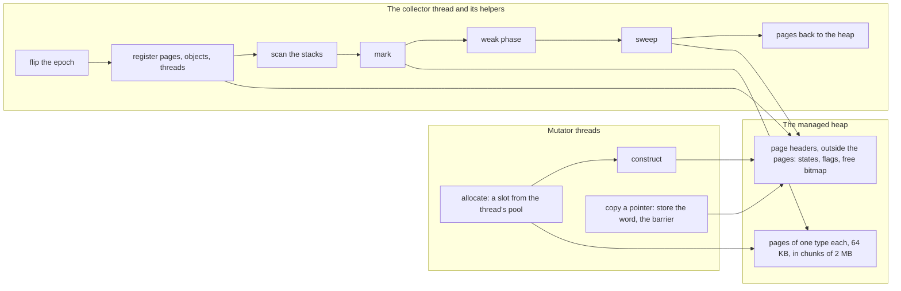
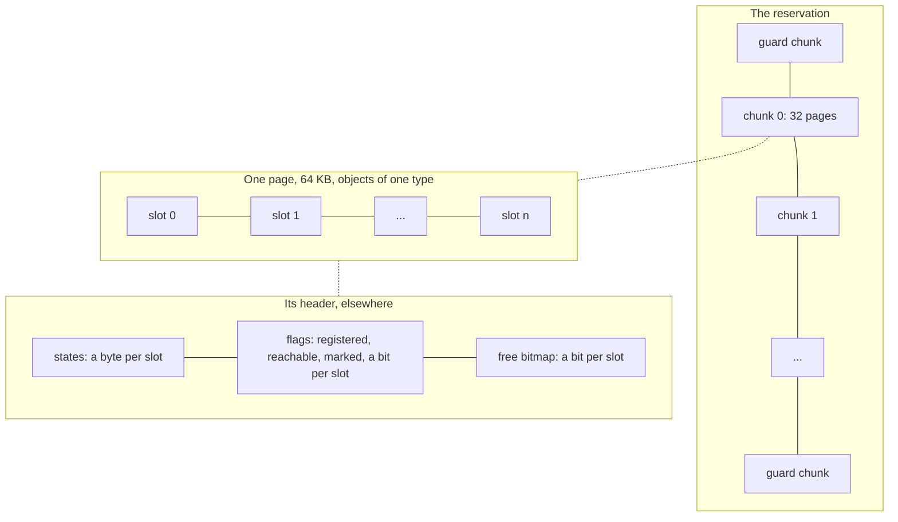
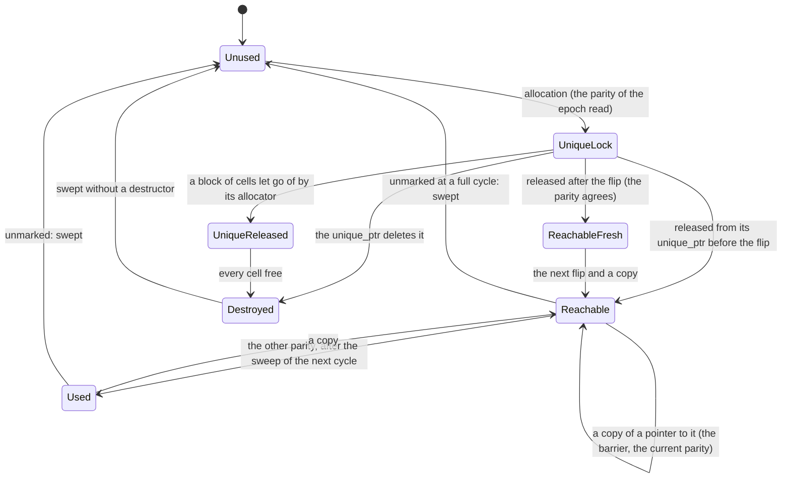
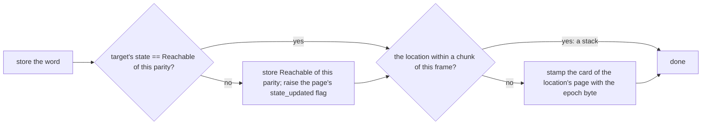
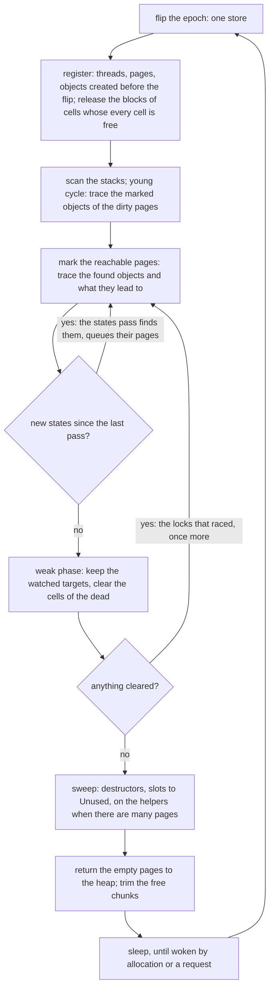
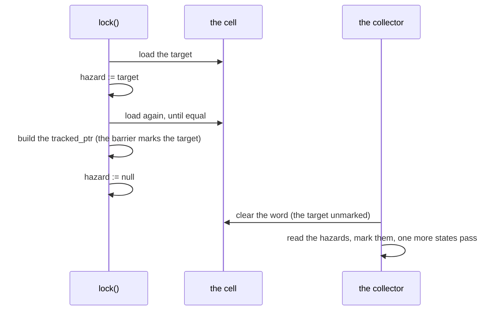

# How the collector works

The account of the engine, from the heap up to a cycle: what a mutator does when it allocates and when it copies a pointer, what the collector's thread does in a cycle, and which invariants let the two run side by side without a pause. The [README](../README.md#how-it-works) has the summary; this page has the mechanism. File names in parentheses are where the code is (`sgcl/detail/`).

## The shape

A managed object lives in a slot of a page that holds objects of its type only. What the collector knows about a slot lives outside the page, in the page's header: a state byte written by the mutators (the barrier, the allocator) and three flag bits written by the collector. A cycle is a flip of the epoch, a registration of what was created since the last cycle, a scan of the stacks, a marking that runs until the states the barrier set meanwhile are exhausted, a pass over the weak cells, a sweep and a return of the empty pages to the heap. Nothing in it stops a mutator, and nothing a mutator does waits for it.

## The heap

(`heap.h`, `os.h`)

One virtual range, reserved at first use and backed lazily, holds every managed object; its base is 2 MB aligned and its bounds are two constants, so `Heap::contains(p)` is a subtraction and a compare. The range is cut into chunks of 2 MB, committed when first used and decommitted when every page in them is free, and chunks into pages of 64 KB. A page belongs to one type: its objects have one size, one destructor, one pointer map. Objects larger than a page take a range of pages of their own.

A side table maps a page's address to its header (a shift and a load), so locating the object of any pointer is arithmetic: `(p - base) >> 16` is the page, and the slot index is a multiply by a constant the header holds. The headers are outside the pages for two reasons: the collector never writes into a data page while it marks (a `fork`ed child reading the heap as a copy-on-write snapshot is not made to copy it), and the mutator that allocates and the collector that marks write different lines.

A guard chunk at both ends of the range lets the barrier tell a stack address from a heap address without a memory read (below).

## An object's slot

(`types.h`, `states.h`, `page.h`)

Every slot has a state byte and three flag bits. The mutators write the byte; the collector reads it and writes the bits.

- `Unused` is a free slot; the allocator's bitmap says which slots are free, and the sweep rebuilds it.
- `UniqueLock` is an object a `unique_ptr` owns: a root by state, never swept, with the parity of the epoch its allocator read (`unique_state`).
- `Reachable` carries the parity of the epoch in which the barrier set it. The state of the current parity says "a pointer to this object was stored in this epoch"; the other parity says nothing, as `Used` does. The flip of the epoch retires every state of the old parity at once without touching it.
- `Fresh` with `Reachable` marks an object handed to its first `tracked_ptr` and not registered yet; with the current parity it says "created after the flip", and the cycle leaves such an object alone.
- `Destroyed` is a slot whose destructor has run (a `unique_ptr` deleted the object, a container destroyed its element): the sweep frees it without running anything.
- `UniqueReleased` is a block of cells of `gc::tracked_ptr`s (below) its allocator will not hand out any more: a root until the collector finds every cell of it free.

The flags: `registered` says the collector knows the slot (it will be swept if not marked); `reachable` is the marking's queue (found, to be traced, in slot order); `marked` is the mark bit, sticky through the young cycles, cleared by a full one.

## Pointers and the write barrier

(`pointer.h`, `page.h`: `set_state`, `mark_card`)

A `tracked_ptr` is one word, the address of the object. A copy of it is the store of the word and the barrier:

This is a Dijkstra insertion barrier: whatever a mutator stores a pointer to is made reachable in the current cycle, so the marking, which reads a snapshot of the graph with mutators writing into it, misses nothing. Two things keep it at 1.4 ns onto the stack and 1.8 into an object:

- Every store is conditional: the states line is shared by 64 slots and the flag by a page, so threads copying pointers to the same object do not bounce those lines; an object gets its state once per cycle.
- The card is skipped for a location near the frame of the store: the heap keeps a guard chunk at both ends, so an address within a chunk of the stack pointer cannot be a page. A local pays no card and reads no memory for the test.

A `unique_ptr` releasing its object to a `tracked_ptr` takes the other path, `store_released`: the state is set first (the parity of the allocation decides between `Reachable` and `Reachable|Fresh`, below), then the word, then the card. The order matters: a thread that loads the word through an atomic and copies it must find the object out of its unique state.

The card table is one byte per 64 KB of address space, indexed by the address, holding the low byte of the epoch of the last store into that page. A young cycle reads a page as dirty when its card holds the current epoch or the one before; nothing ever clears a card, so no store is lost to a clear.

## Roots

A cycle's roots are:

- **The stacks**, scanned conservatively: every word of the used part of every registered thread's stack that points into the heap, at a slot in use, is a root. The used part is what the thread's stack pages have touched (`os::touched_pages`), read in segments, on the helpers when there is more than `StackScanThreshold` of it. A thread is registered by the first `tracked_ptr` it constructs, and forgets itself when it exits, after a handshake with a scan in progress: it raises `exiting` and waits for `stack_scan` to drop. The scan reads the stack of a running thread as it is; a dead word keeps its target for a cycle, which `clear_stack()` cuts short.
- **The objects a `unique_ptr` owns**: `UniqueLock` by state, wherever the `unique_ptr` is (a global, a member, a `std` container).
- **The blocks of cells** of `gc::tracked_ptr`s in unmanaged memory, `UniqueLock` or `UniqueReleased` by state.
- **The hazard pointers** of the threads: an object a thread is loading from an atomic at that moment.
- **The watched weak cells**: an object an `expiry_queue` is to be told about is kept for one more round.

The stacks are scanned once, at the start of the cycle. Everything a thread copies onto its stack after that is covered by the barrier (the state of the copy's target), not by the scan.

## A cycle

(`collector.h`: `_main_loop`)

The gates of [`collector::stepper`](collector.md#stepper) sit at these boundaries: `flipped`, `registered`, `roots`, `marked` (after the weak phase), `swept`, `released`.

**The flip** advances the epoch: one atomic store of the new `Reachable|parity` value the barrier will use from now on. Every state of the old parity is out of date from this moment, without a pass over the heap.

**The registration** takes what was created before the flip: every thread that registered itself, every page those threads published, every slot on a page whose `object_created` flag is up whose state says created, except the ones `Reachable|Fresh` with the current parity, which were allocated and handed to their first pointer after the flip (below). A registered slot is one the sweep may free; an unregistered one is never swept and never traced from the roots, so an object created during the cycle costs the cycle nothing.

**The stack scan** marks what the stacks hold. In a young cycle the dirty pages are traced here too: every object marked before this cycle on a page whose card holds this epoch or the last has its pointers followed again, since the objects marked in earlier cycles are not traced from the roots (the marks of the dirty pages are taken down before the pass, so that the young objects the pass marks meanwhile are traced once).

**The marking** runs in rounds until it converges. A round traces every object found reachable and everything those lead to, by the type's pointer map; then the states pass looks at the unmarked registered slots of the pages the barrier touched since (`state_updated`) and finds the ones whose state is `Reachable` of the current parity, or `UniqueLock`, or `UniqueReleased`: objects a mutator stored a pointer to while the round ran, and roots by state. They are queued and the next round traces them. The pass over all the pages, in the round that starts with an empty queue, also registers late the objects released after the flip with an allocation parity that was not the current one (below). It reads the flags of a page only when the page may hold registered slots that are not marked: a bit of the header says so, raised by the registration and by a full cycle's clearing of the marks, lowered once a pass finds every registered slot marked or the sweep has folded the page; in a young cycle that leaves the old pages out, and the registration likewise looks only at the pages the mutators touched since the last cycle (their `object_created` and `state_updated` flags). The rounds end when a pass finds nothing new. The states of the old parity are left as they are through the marking (they say nothing in this cycle) and turned to `Used` after the sweep, on the survivors only: the parity has two values, so a state left from two cycles ago would read as current again, and the dead had their states cleared by the sweep anyway, which spares an allocation-heavy program a compare-exchange per eight of them.

**The weak phase** runs after convergence: the cells of the `weak_ptr`s whose target is unmarked are cleared, except the ones an `expiry_queue` watches, whose targets are marked instead and kept for one round more. A cleared cell may have raced with a `lock()`: the locks publish a hazard pointer, so the hazards are marked and one more states pass runs.

**The sweep** goes over the pages with unmarked registered slots: the destructor of each (on the pool when there are `SweepPageThreshold` pages or more, so that destructors of many objects run in parallel, in no order), the slot to `Unused`, the free bitmap of the page rebuilt for its allocator; then the states of the old parity on the survivors of the pages the barrier touched before the registration go to `Used`. A page with nothing left goes back to the heap, zeroed, and a chunk with no page in use is decommitted.

The counting for the statistics happens between the marking and the sweep: the objects marked by this cycle are the live ones.

## Epochs, parity and the objects created during a cycle

(`page.h`: `set_state_released`, `collector.h`: `_register_page`, `_register_late`)

The barrier's state is a promise about the current cycle only, and the flip is how the promise expires: a state carries the parity of its epoch, and the states pass looks for the current parity. This is what lets the collector skip a pass that would demote every state.

An object created during a cycle is not registered by that cycle, so it cannot be swept by it; what it points to is safe because the stores of its constructor set states with the new epoch, which the states pass finds. That holds if every store of the constructor ran after the flip. It does not hold for an object allocated *before* the flip and handed to its first `tracked_ptr` *after* it: its constructor's stores read the old epoch, and the flip retired them. So the allocator records the parity of the epoch it read in the `UniqueLock` state, and the release compares: the same parity as now means the object was allocated after the flip, and it becomes `Reachable|Fresh`, which the registration skips; a different parity means the object was allocated before the flip, and it becomes `Reachable` of the current parity, registered by the cycle like any object made before the flip, reachable by its state should its thread's stack have been scanned already. An object released this way after the registration round is registered late, before every round of the marking, and traced.

The released state is set before the word that publishes the object, so that no thread ever loads a pointer to an object still in its unique state: the ordinary barrier assumes a released object and does not carry the transition.

## Young and full cycles

(`collector.h`: `_choose_full_cycle`, `_collect_dirty_pages`)

The marks are sticky: a young cycle clears none of them and traces only two things, the objects it finds new (the survivors of what was created since the last cycle, reached from the roots) and the marked objects on the dirty pages, whose pointers may have changed. An old object that dies stays marked until a full cycle, which clears every mark and traces the heap from the roots.

A cycle is full when eight young ones have run since the last full one, when the live memory grew by 100% since it, when a collection was forced, or when the heap is near its ceiling. The cost of a young cycle is the young objects and the dirty pages; a program that links old objects more than it allocates stamps a card on every such store and has the whole page retraced, which is what `-DSGCL_GENERATIONAL=0` (full cycles only, a barrier without cards) is for.

The collector wakes for a cycle when the pages allocated since the last one exceed a quarter of what that one left in use (at least 64 pages), when a collection is requested, or when the heap is near its ceiling; otherwise it sleeps 30 seconds between cycles, 3 after a cycle that freed much, 100 ms under pressure.

## Marking in parallel

(`collector.h`: `_mark_parallel`, `WorkerPool`)

The marking is one pass whether the collector's thread runs it alone or, once a cycle has `MarkObjectThreshold` objects to mark (a million), with a pool of helper threads, one per quarter of that and up to the cores. The pages the roots reached are dealt out one at a time and traced in page order: the thread holds the page while it loops over its words of reachable bits, marking (a relaxed `fetch_or` after a plain test that spares the objects marked already) and tracing the objects in slot order, a few prefetched ahead; a child on the same page becomes a bit the loop takes next, so that a structure laid out by its allocation is read in address order. A child on another page goes on the thread's stack, traced depth first once the page is done, through a window of eight (`config::MarkPrefetchWindow`), each object prefetched as it enters and traced when it leaves: the depth-first order over a graph laid out at random misses the cache at every object, and the window lets the misses overlap instead of waiting one at a time, which halves the marking of a random graph. A child found on the traced object's page during that drain gets a bit and lists the page for the thread (the page's holder, if there is one, takes the bit instead: it checks the bits once more after letting the page go). Half of a thread's stack and pages, the older half, goes to a shared pile whenever another thread is parked for want of work, and the pass ends when every thread is parked. The mark bit is the only word the helpers share; the states pass and the weak phase stay on the collector's thread. The sweep and the stack scan go to the pool by their own thresholds.

## Weak pointers, the expiry queue, atomics

(`weak_ptr.h`, `weak_cell.h`, `expiry_queue.h`, `atomic.h`, `detail/atomic_word.h`)

A `weak_ptr` is a `tracked_ptr` to a cell: a managed object of its own type, holding the target as a word the collector does not trace (the type's pointer map is empty). The cells of a program lie on the pages of that one type, which is how the weak phase finds them. `lock()` reads the cell's word twice around the store of a hazard pointer and builds a `tracked_ptr` while the hazard is up:

Either the lock sees the cleared word and returns null, or it published its hazard before the clearing, and the collector's pass after the clearing marks the target, which the `tracked_ptr` the lock built holds from then on. An atomic's `load()` is the same protocol on the atomic's word.

An `expiry_queue` marks its cells `Watched`: the weak phase, finding such a target unreachable, marks it reachable instead and sets `Expired`; `drain()` hands the object to the function alive, and from then on the cell is an ordinary one.

The weak containers (`weak_map.h`, `weak_set.h`, `detail/weak_table.h`) are hash tables keyed by weak pointers, hashed and compared by the cell's word read without a lock: the word holds the object's address while the object lives, and the weak phase clears it before the sweep frees the slot, so a word never names a slot's earlier occupant and a cleared key equals nothing, its own entry included. The hash of a key changes when its object dies, which the table survives because it keeps the hash it placed each node with (the hash is not `noexcept`, which is what makes libstdc++ cache it). The dead entries are dropped by a pass over the table every so many insertions, as many as the table has entries.

## The `gc::` family

(`gc/tracked_ptr.h`, `cell_block.h`, `types.h`: `UniqueReleased`)

A `gc::tracked_ptr` is a `tracked_ptr` that may live in unmanaged memory. Its constructor decides where it is (the heap's range, then the thread's stack bounds from a thread-local): inside a managed object or on a stack it is a `tracked_ptr`, one word; anywhere else the word is the address of a cell with the sign bit set. A cell is a word of a block, a managed object of a cache line of pointers, handed out by the thread's allocator in order and zeroed; the pointer stores into it through the barrier, and its destructor writes the cell's own address back, the mark of a free cell. The block is `UniqueLock` while the allocator may still hand out a cell of it, `UniqueReleased` after: a root either way, traced by its words without a map, and freed by the cycle whose registration finds every cell free. The collector never sees the tagged form of the word: it exists only in memory the collector does not read.

The containers, atomics and coroutines of `gc::` are the `sgcl::` ones with a `gc::tracked_ptr` as the word by which they hold their memory; the elements they store are `sgcl::tracked_ptr`s in managed memory either way.

## `sgcl::` against `gc::`: what differs, and when to use which

Every name exists in both namespaces with one interface; what differs is the word a pointer is, and so where it may live and what a copy costs.

An `sgcl::tracked_ptr` is the word itself: the address of the object, stored with the barrier. The collector finds such a word in exactly two places, inside a managed object (through the type's pointer map) and on a thread's stack (through the scan), and nowhere else: that is rule 1, and it is not a convention but the mechanism. An `sgcl::tracked_ptr` in `new`/`malloc` memory, in a `std` container, in a global or in a plain coroutine frame is a word nothing reads; its object is garbage at the next cycle. A debug build asserts at the construction; a release build does not, and the object goes.

A `gc::tracked_ptr` is the same word where the word may live, and elsewhere the address of a cell in a managed block, which the collector reads. The price is paid where the mode is decided and where it is read:

| | `sgcl::` | `gc::` |
|---|---|---|
| construction on the stack | a store with the barrier, 1.2 ns | the same, after the check of the address: the heap's range, then the thread's stack bounds from a thread-local, 1.7 ns (a thread-local read costs more on Apple silicon than on Linux) |
| construction as a member of a managed object | the same | the same after the heap's range check, a few tenths |
| construction in unmanaged memory | not allowed | a cell taken from the thread's block, 7 ns with its release |
| a store into it | the word and the barrier, 1.4 ns | plus a test of the sign, 1.6 ns |
| a read through it | a load, 0.42 ns | plus a test of the sign, 0.45 ns |
| `weak_ptr::lock()` | 1.8 ns | 2.5 ns: the result is a `gc::tracked_ptr` built where the caller puts it |
| a lock-free stack, one thread | 9.7 ns per operation | 12.7 ns: the loaded head and the new node are constructions on the stack |
| binary-trees, a node of two pointers | 1× | 1.2×: every node is two members and three temporaries |
| the containers | the same nodes and buffers; a `gc::` container pays the test on its root word, within the run-to-run spread | |

The cost of `gc::` is concentrated in one place: the constructions on the stack, the temporaries, the values returned and the arguments passed, because each decides its mode with a thread-local read that the compiler cannot hoist out of a function call. Members of managed objects and the elements of containers cost almost nothing more, and a store or a read through either kind is within a tenth of a nanosecond.

So the rule of thumb:

- **`sgcl::` for the code that keeps its pointers where the collector looks anyway**: a node structure and the algorithms over it, a lock-free structure, a hot loop with pointer temporaries, the members of managed objects, coroutines on managed frames. This is most of a program's inner code, and it runs at the numbers of the `sgcl::` columns.
- **`gc::` at the boundary, where rule 1 cannot be kept**: a global that holds a managed object, a `std::vector` or `std::map` of managed pointers, a `std::function` whose closure goes to the heap, a plain coroutine, a plugin or a library that keeps managed objects in structures of its own, a `gc.new<T>` arena for another language. A `gc::` container is a container that lives in such a place; its elements are stored as `sgcl::tracked_ptr`s inside its managed buffer whichever type they are declared as.

The two convert into each other at the cost of one direction only: a `gc::tracked_ptr` converts to the word it holds by (`operator sgcl::tracked_ptr<T>&`), a copy of a word, with no check; an `sgcl::tracked_ptr` converts to a `gc::tracked_ptr` with the check of the destination. The atomics take `sgcl::tracked_ptr`s inside and hand out the `value_type` of their kind; the containers store `sgcl::tracked_ptr`s and hand out references of the element type declared. A program written in `gc::` that has a hot loop may declare that loop's locals `sgcl::tracked_ptr` and lose nothing but the check; a program written in `sgcl::` keeps a `gc::` pointer for the one global and the one `std` container it has.

What the choice never changes: the objects, the allocation, the cycles, the roots the collector sees, the destructors and when they run. A `gc::tracked_ptr` in a managed object *is* an `sgcl::tracked_ptr`, and the collector cannot tell a `gc::` program from an `sgcl::` one.

## Allocation

(`object_pool_allocator_base.h`, `maker.h`, `page_allocator.h`)

Every thread has an allocator per type: a current page, the word of its free bitmap it is working on, and the states of that word's slots. An allocation is a `countr_zero` on the word, a clear of the bit, and a release store of `UniqueLock` with the parity into the slot's state; then the constructor runs, on a slot the collector may already read. The words at the type's pointer offsets are null then: the page was zero when the type got it (fresh from the heap, or zeroed by the collector when its last type gave it back), and every object of the type that died in the slot left its pointer words null (the destructors of `tracked_ptr` and `unique_ptr` store a null). What the collector reads during a constructor is null or a final value at every pointer offset, and the map's elimination classifies the rest as data.

A page whose current word is exhausted gives the allocator the next word with a free slot (a summary bit per word); a page with none gets the thread a page from its cache of pages taken from the heap under the heap's mutex, a few at a time. A buffer (the memory of a container) is an object of a size class with a header naming the element type and the capacity, zeroed for the elements when they may hold pointers, and traced by the element type's map over its capacity.

The type's pointer map (`child_pointers.h`) starts full, every word a candidate, and the collector narrows it by elimination: a word found holding a non-zero value that is not a managed address is data, and its offset leaves the map for good. Pointer fields only ever hold null or a managed address, so they never leave. This is what a `std::variant` or a `std::any` holding a `tracked_ptr` breaks, and what `variant.h` and `any.h` (`detail/pointer_word.h`) are for: the pointer words (`tracked_ptr` of either kind, `weak_ptr`: one word, null or an address, null again after its destructor) get a word of their own, shared among themselves only; an alternative that may hold pointers among its data (`MayContainTracked`) gets an offset range of its own; the data shares the rest. An `any` puts a value that may hold pointers into a managed object owned like by a `unique_ptr` (a root by the state of its slot, `delete_unique` when dropped) and keeps its address in the pointer word.

 A type that cannot hold a pointer (`type_info.h`: `MayContainTracked` is false for a trivially default constructible type, a `tracked_ptr` has a constructor, and for one smaller than a pointer) gets an empty map from the start, and an empty map is a test of one flag in the marking (`_mark_array_childs`, `_mark_childs`): the buffer of a `vector<int>` is marked as one object and its contents never read, nor zeroed on allocation. The node of a `list<int>` or a `map<int, int>` is links and an element: the element's words leave the node type's map at the first node found holding data in them (a word holding zero is skipped, not classified, so an offset stays until a node has a non-zero value there), after which the marking reads the links alone.

## What makes it pause-free

- The barrier makes every stored pointer's target reachable in the cycle that runs: the marking needs no stop to take a consistent snapshot.
- The flip retires the states of the previous cycle without a pass, so a cycle begins with one store.
- Objects created during a cycle are not registered by it: they are neither swept nor traced, and what they point to is reachable by state.
- The stacks are scanned once, while the threads run; a thread that exits waits only for the scan of its own stack.
- A `unique_ptr`'s object is a root by its state, wherever the `unique_ptr` is; a `gc::tracked_ptr`'s cell is a word of a root by state.
- The sweep runs destructors on the collector's threads, ordered after the cycle that found the object unreachable, and a destructor reads its dying peers through `if_alive()`.
- The mutators wait on nothing of the collector's: a page from the heap under a mutex once per 64 KB, and the memory ceiling.
